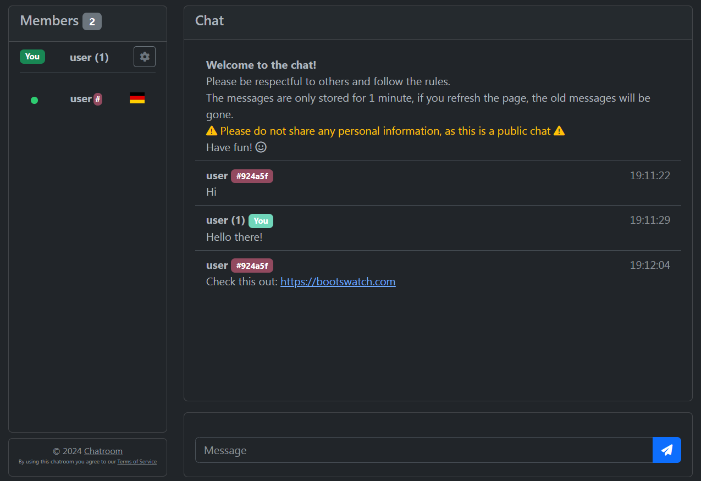
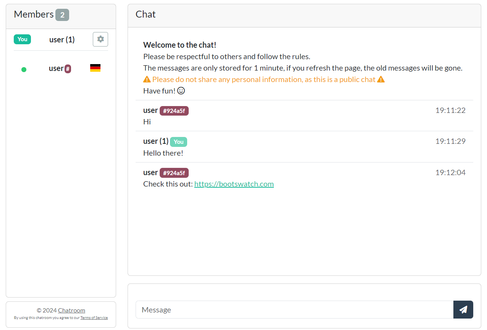
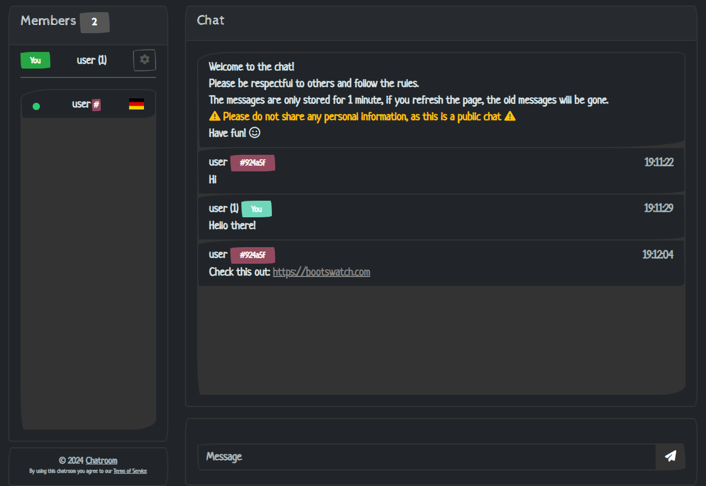

# Yet Another Chatroom

## Introduction

This is a chatroom application that allows users to send messages to each other in real time. The application is built in plain HTML, CSS, and JavaScript, and uses the PHP and SQLite for the backend.

## Table of contents

- [Yet Another Chatroom](#yet-another-chatroom)
  - [Introduction](#introduction)
  - [Table of contents](#table-of-contents)
  - [Features](#features)
  - [Screenshots](#screenshots)
  - [Demo](#demo)
  - [Installation](#installation)
  - [Configuration](#configuration)
  - [License and credits](#license-and-credits)
  - [Contributing](#contributing)
  - [JM26.NET](#jm26net)

## Features

- 📨 Easy to use and maintain chatroom
- 📡 Real-time messaging
- ⚙️ Customizable settings
- 📜 60second history mode
- 🛡️ Privacy friendly public chatroom
- 📱 Responsive design
- 🎨 Themes
- 🚫 Spam filter
- 🎉 Captcha
- :construction: More features to come

## Screenshots

For more screenshots, see the [theme-thumbnail](./assets/theme-thumbnail) folder.

## Demo

Will be available soon.

## Installation

**NOTE**: This project is under active development and is not yet ready for production use. Please use with caution.

1. Donwload the latest release from the [releases page](./releases)
2. Extract the files to your web server (subdirectory or root)
3. Open the chatroom in your web browser
4. Customize in config.php and enjoy! 🎉

## Configuration

The chatroom can be configured by editing the `config.php` file. The settings are explained in the file itself.

## License and credits

This project is licensed under the MIT License - see the [LICENSE](./LICENSE) file for details.

The chatroom uses the following libraries:

- [Cheetahchat](https://github.com/hamidsamak/cheetahchat) by Hamid Samak
- [iconCaptcha](https://github.com/fabianwennink/IconCaptcha-Plugin-jQuery-PHP) by Fabian Wennink
- [Spam Filter](https://github.com/IQAndreas/php-spam-filter) by Andreas Gohr

## Contributing

Feel free to contribute to this project by creating a pull request. If you have any questions, feel free to open an issue.

## JM26.NET

This project is made by [JMcrafter26](https://jm26.net). Refer to the [TEST.JM26.NET](https://test.jm26.net) for more information and other projects.
